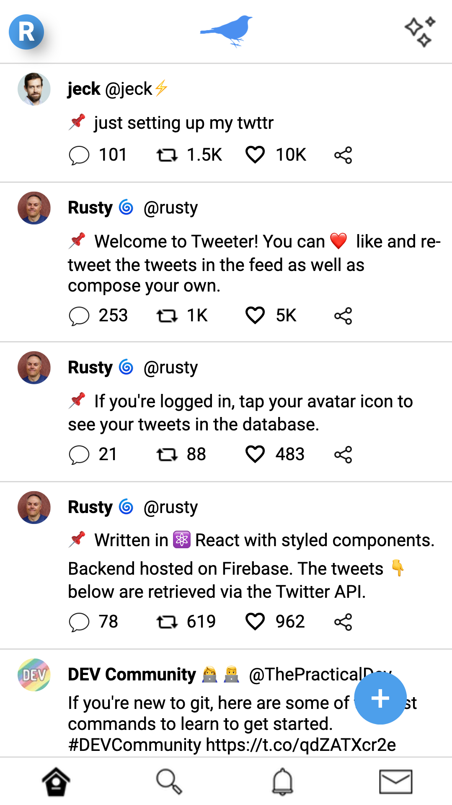
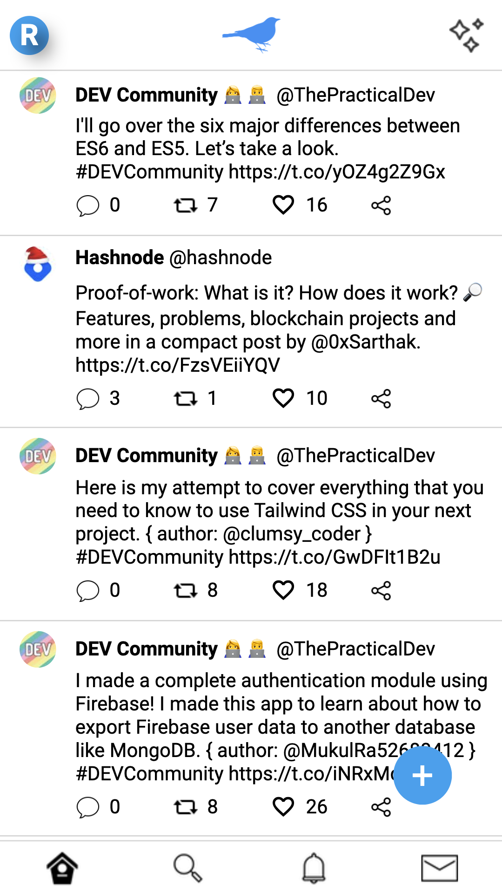

Production delays

I've basically completed my Twitter clone --it's fully functional in **development** mode. 😃 Besides tweeting, liking, and retweeting, it fetches recent webdev tweets from the Twitter API and displays them in the feed: 
&nbsp;&nbsp;  

It's ready for production, ie. being hosted so that you can use it. But I've hit a snag... apparently the Twitter API doesn't support CORS headers, which are related to internet security. What this means for me is that I can't fetch tweets directly from my front end app. The requests need to come from a server. 🤔

Bottom line, I celebrated a bit too early and now I'll need to spend some more time learning about how to get it up and running. I'll be over here looking into the fascinating world of middleware and serverless functions. Stay tuned.

Array methods

findIndex and indexOf 

