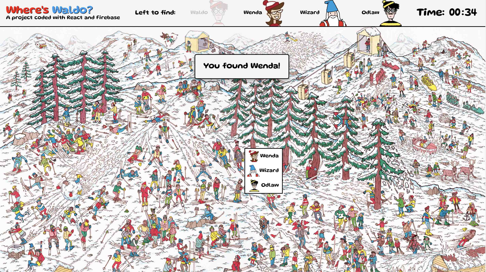
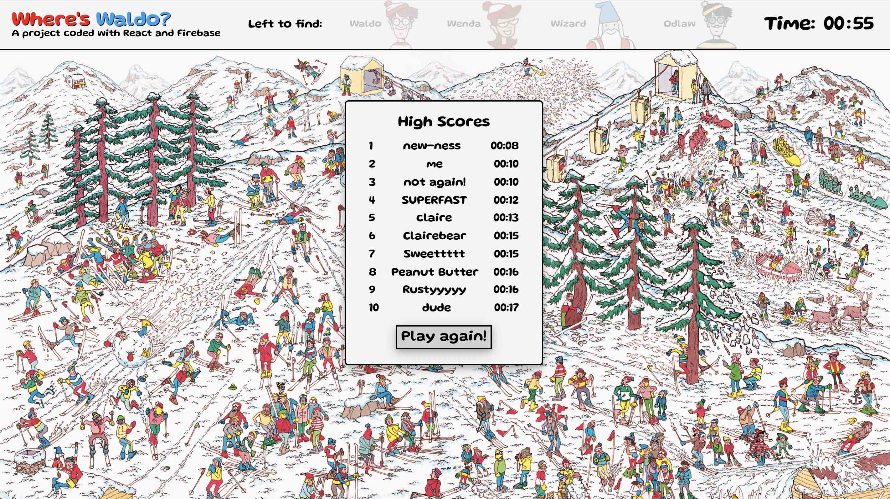
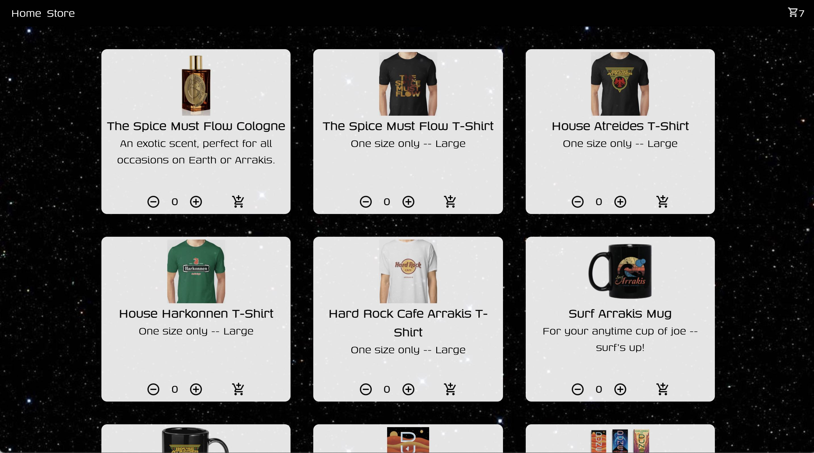
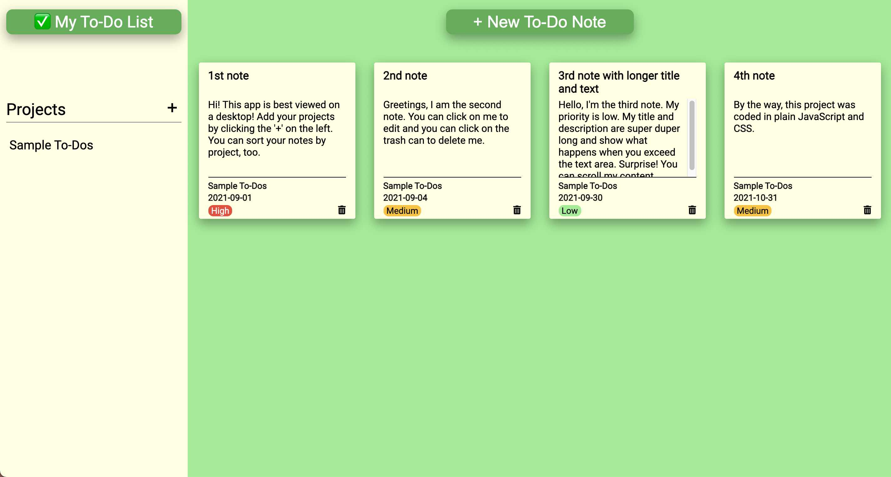
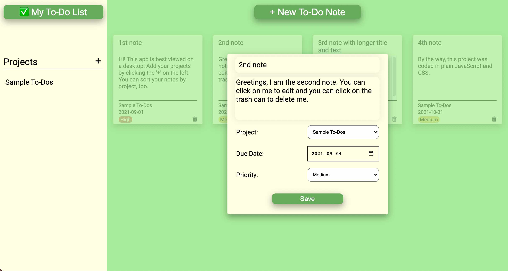
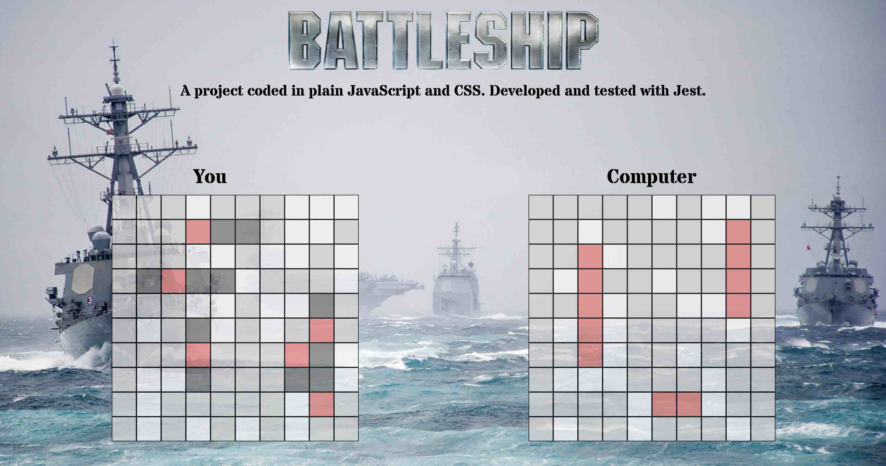
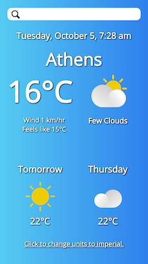
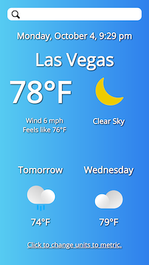

## *worldschoolingpopups.com* &nbsp;🌏

&nbsp;&nbsp;&nbsp;&nbsp;&nbsp;&nbsp;&nbsp;

> Date completed: March 3, 2022  
> Date updated: August 12, 2023  
Repo: [github.com/rusty-reebs/worldschoolingpopups-next](https://github.com/rusty-reebs/worldschoolingpopups-next)  
Live site: [https://worldschoolingpopups.com](https://worldschoolingpopups.com)  
Optimized for 📱 &nbsp;mobile and&nbsp; 🖥 &nbsp;desktop!  

Note: updated in 2023 to Next.js for static site generation and incremental static regeneration with a Supabase backend.

Filling a need for a central listing of worldschooling events, this REST API is built in Express. It features an AirBnB-style public frontend where users can browse events, and a separate admin frontend with JSON web token (JWT) authentication in the form of a header cookie. I also used React to conditionally render optional information such as excursions and age range. Maps and image handling are provided via the Google Maps and Cloudinary APIs, respectively.  

&nbsp;&nbsp;  

&nbsp;&nbsp;  

----

## Members Clubhouse authentication app&nbsp;👥

&nbsp;&nbsp;&nbsp;&nbsp;

> Date completed: February 5, 2022  
Code repo: [github.com/rusty-reebs/members-clubhouse](https://github.com/rusty-reebs/members-clubhouse)  
Live site: [comfortable-hare-pantyhose.cyclic.app/](https://comfortable-hare-pantyhose.cyclic.app/)  
Optimized for 📱 &nbsp;mobile and&nbsp; 🖥 &nbsp;desktop!  

This fun message board app explores user authentication, permissions, and security with PassportJS, localStrategy, express-session, bcryptJS, and `.env` files. After becoming a member, users are able to see the previously blurred-out content and make public posts. Styling was a breeze with Tailwind! 👍👍

&nbsp;&nbsp;&nbsp;&nbsp; 

----

## Cycle Logical CRUD app&nbsp;🚵‍♂️

&nbsp;&nbsp;&nbsp;&nbsp;

> Date completed: January 29, 2022  
Code repo: [github.com/rusty-reebs/inventory-app](https://github.com/rusty-reebs/inventory-app)  
Live site: *Currently under maintenance.*  
Optimized for 📱 &nbsp;mobile and&nbsp; 🖥 &nbsp;desktop!  

Utilizing the MVC (Model, View, Controller) design pattern, this Express app allows the user to perform CRUD (Create, Read, Update, Delete) operations with a backend NoSQL database. I also implemented image uploading via the Cloudinary API and used Bootstrap for responsive styling.

&nbsp;&nbsp;  

&nbsp;&nbsp;  

----

## Tweeter social media app&nbsp;🦜

&nbsp;&nbsp;&nbsp;&nbsp;&nbsp;&nbsp;

> Date completed: January 8, 2022  
Code repo: [github.com/rusty-reebs/twitter-clone](https://github.com/rusty-reebs/twitter-clone)  
Live site: *Not available due to new Twitter API policy 😪* 
Optimized for 📱 &nbsp;mobile and&nbsp; 🖥 &nbsp;desktop!  

Building on my previous experience, this project added some extra complexities like user authentication and a serverless backend function to call the Twitter API. Plus the usual fun stuff like async functions, conditional rendering, and the `useState`/`useEffect` hooks. Try out its interactive features!

  

----

## Where's Waldo&nbsp; 🔎&nbsp; photo-tagging app

&nbsp;&nbsp;
&nbsp;

> Date completed: December 4, 2021  
Code repo: [github.com/rusty-reebs/wheres-waldo](https://github.com/rusty-reebs/wheres-waldo)  
Live site: [rusty-reebs.github.io/wheres-waldo](https://rusty-reebs.github.io/wheres-waldo)  
Optimized for&nbsp; 🖥 &nbsp;desktop and &nbsp;📱 &nbsp;landscape mobile!  

This was a great project involving many practical programming skills like conditionals, asynchronous functions, and manipulating arrays. I gained a stronger understanding of React hooks like `useEffect` and how to set up and use a BaaS (Backend-as-a-Service) site, eg. Firebase.  

  

  

-----

## Shopping cart app 🛒

&nbsp;&nbsp;&nbsp;

> Date completed: November 23, 2021  
Code repo: [github.com/rusty-reebs/shopping-cart](https://github.com/rusty-reebs/shopping-cart/)  
Live site: [rusty-reebs.github.io/shopping-cart](https://rusty-reebs.github.io/shopping-cart/)  
Optimized for&nbsp;📱 &nbsp;mobile and &nbsp;🖥 &nbsp;desktop!  

Written in ⚛️ React.js and plain CSS. Practiced using `react-router-dom`, functional components, and hooks. I had a lot of fun coding this project! One of the biggest challenges was thinking about how to organize and manage objects that are in state.  

  

  

-----

## To-Do List app ✅

&nbsp;&nbsp;&nbsp;

> Date completed: November 5, 2021  
Code repo: [github.com/rusty-reebs/to-do-list](https://github.com/rusty-reebs/to-do-list)  
Live site: [rusty-reebs.github.io/to-do-list](https://rusty-reebs.github.io/to-do-list/)  
Best viewed on&nbsp; 🖥 &nbsp;desktop.  

Written in plain JavaScript and plain CSS. Practiced using and manipulating dynamically-created objects in JavaScript. This was a complex project with a lot of moving parts! Also had to manage event listeners and bubbling.

  

  

-----

## Battleship game 🚢

&nbsp;&nbsp;&nbsp;&nbsp;

> Date completed: November 2, 2021  
Code repo: [github.com/rusty-reebs/tdd-battleship](https://github.com/rusty-reebs/tdd-battleship)  
Live site: [rusty-reebs.github.io/tdd-battleship](https://rusty-reebs.github.io/tdd-battleship/)  
Best viewed on 🖥 desktop.  

Written in plain JavaScript and plain CSS. Learned to use test-driven development with Jest. Practiced OOP principles such as the Single Responsibility Principle. (Could use more practice with this! 😅)  

  

-----

## Weather app ☀️

&nbsp;&nbsp;&nbsp;

> Date completed: October 3, 2021  
Code repo: [github.com/rusty-reebs/weather-app](https://github.com/rusty-reebs/weather-app)  
Live site: [rusty-reebs.github.io/weather-app](https://rusty-reebs.github.io/weather-app/)  
Optimized for 📱 mobile and 🖥 desktop.

Written in plain JavaScript and plain CSS. Learned to use APIs and asynchronous functions in JavaScript. Processed all time data myself without libraries. Also used CSS media queries for responsiveness.  

&nbsp;&nbsp;

-----

## Restaurant page ☕️  

&nbsp;&nbsp;&nbsp;

> Date completed: August 17, 2021  
Code repo: [github.com/rusty-reebs/restaurant-page](https://github.com/rusty-reebs/restaurant-page)  
Live site: [rusty-reebs.github.io/restaurant-page](https://rusty-reebs.github.io/restaurant-page/)  
Best viewed on 🖥 desktop.  

Written in HTML, CSS, and plain JavaScript.  Learned to use ES6 modules and webpack to dynamically render pages with JavaScript.  

----

## Tic Tac Toe ❌⭕️❌

&nbsp;&nbsp;

> Date completed: August 5, 2021  
Code repo: [github.com/rusty-reebs/tic-tac-toe](https://github.com/rusty-reebs/tic-tac-toe)  
Live site: [rusty-reebs.github.io/tic-tac-toe](https://rusty-reebs.github.io/tic-tac-toe)  

Written in HTML, CSS, and JavaScript. Practiced writing factory functions, methods, module patterns and IIFEs.  



-----

## Library 📚

&nbsp;&nbsp;

> Date completed: July 15, 2021  
Code repo: [github.com/rusty-reebs/library](https://github.com/rusty-reebs/library)  
Live site: [rusty-reebs.github.io/library](https://rusty-reebs.github.io/library/)  

Written in HTML, CSS, and JavaScript.  Practiced using JS objects, `Array.forEach()` method, `Object.keys()` method, and local storage.  

