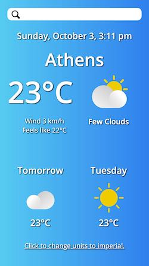
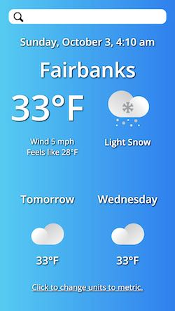

## Weather app ☀️

> Date completed: October 3, 2021  
See the [live code](https://github.com/rusty-reebs/weather-app) on my GitHub! Or try it out [here](https://rusty-reebs.github.io/weather-app/). It's best viewed on 📱 mobile.

*Written in HTML, CSS, and plain JavaScript. Learned to use APIs and asynchronous functions in JavaScript. Processed all time data myself without libraries. Also used CSS media queries for responsiveness.*  

  

## Restaurant page ☕️  

> Date completed: August 17, 2021  
See the [live code](https://github.com/rusty-reebs/restaurant-page) on my GitHub! Browse the site [here](https://rusty-reebs.github.io/restaurant-page/).  

*Written in HTML, CSS, and plain JavaScript.*
*Learned to use ES6 modules and webpack to dynamically render pages with JavaScript.*
  

----

## Tic Tac Toe ❌⭕️❌

> Date completed: August 5, 2021  
See the [live code](https://github.com/rusty-reebs/tic-tac-toe) on my GitHub! Play the game [here](https://rusty-reebs.github.io/tic-tac-toe)!  

*Written in HTML, CSS, and JavaScript.*
*Practiced writing factory functions, methods, module patterns and IIFEs.*



----

## Library 📚

> Date completed: July 15, 2021  
See the [live code](https://github.com/rusty-reebs/library) on my Github! Try it yourself [here](https://rusty-reebs.github.io/library/)!  

*Written in HTML, CSS, and JavaScript.*
*Practiced using JS objects, Array.forEach() method, Object.keys() method, and local storage.*

---

**More super awesome projects coming soon!** 🚀