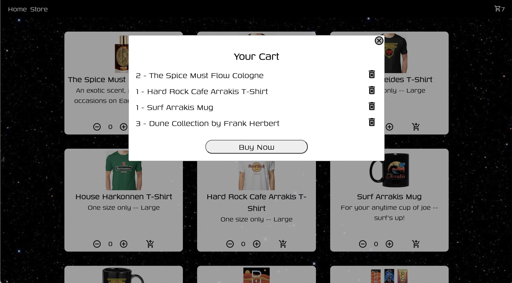

## Where's Waldo&nbsp; 🔎&nbsp; photo-tagging app

&nbsp;&nbsp;
&nbsp;

> Date completed: December 4, 2021  
See the [live code](https://github.com/rusty-reebs/wheres-waldo) on my GitHub! You can try it [here](https://rusty-reebs.github.io/wheres-waldo).  
Optimized for&nbsp; 🖥 &nbsp;desktop and &nbsp;📱 &nbsp;landscape mobile!  

This was a great project involving many practical programming skills like conditionals, asynchronous functions, and manipulating arrays. I gained a stronger understanding of React hooks like `useEffect` and how to set up and use a BaaS (Backend-as-a-Service) site, eg. Firebase.  

  

  

-----

## Shopping cart app 🛒

&nbsp;&nbsp;&nbsp;

> Date completed: November 23, 2021  
See the [live code](https://github.com/rusty-reebs/shopping-cart/) on my GitHub! You can try it [here](https://rusty-reebs.github.io/shopping-cart/).  
Optimized for&nbsp;📱 &nbsp;mobile and &nbsp;🖥 &nbsp;desktop!  

Written in ⚛️ React.js and plain CSS. Practiced using `react-router-dom`, functional components, and hooks. I had a lot of fun coding this project! One of the biggest challenges was thinking about how to organize and manage objects that are in state.  

  

  

-----

## To-Do List app ✅

&nbsp;&nbsp;&nbsp;

> Date completed: November 5, 2021  
See the [live code](https://github.com/rusty-reebs/to-do-list) on my GitHub! Or try it [here](https://rusty-reebs.github.io/to-do-list/).  
Best viewed on&nbsp; 🖥 &nbsp;desktop.  

Written in plain JavaScript and plain CSS. Practiced using and manipulating dynamically-created objects in JavaScript. This was a complex project with a lot of moving parts! Also had to manage event listeners and bubbling.

  

  

-----

## Battleship game 🚢

&nbsp;&nbsp;&nbsp;&nbsp;

> Date completed: November 2, 2021  
See the [live code](https://github.com/rusty-reebs/tdd-battleship) on my GitHub! Or play it [here](https://rusty-reebs.github.io/tdd-battleship/).  
Best viewed on 🖥 desktop.  

Written in plain JavaScript and plain CSS. Learned to use test-driven development with Jest. Practiced OOP principles such as the Single Responsibility Principle. (Could use more practice with this! 😅)  

  

-----

## Weather app ☀️

&nbsp;&nbsp;&nbsp;

> Date completed: October 3, 2021  
See the [live code](https://github.com/rusty-reebs/weather-app) on my GitHub! Or try it out [here](https://rusty-reebs.github.io/weather-app/).  
Optimized for 📱 mobile and 🖥 desktop.

Written in plain JavaScript and plain CSS. Learned to use APIs and asynchronous functions in JavaScript. Processed all time data myself without libraries. Also used CSS media queries for responsiveness.  

&nbsp;&nbsp;

-----

## Restaurant page ☕️  

&nbsp;&nbsp;&nbsp;

> Date completed: August 17, 2021  
See the [live code](https://github.com/rusty-reebs/restaurant-page) on my GitHub! Browse the site [here](https://rusty-reebs.github.io/restaurant-page/).  
Best viewed on 🖥 desktop.  

Written in HTML, CSS, and plain JavaScript.  Learned to use ES6 modules and webpack to dynamically render pages with JavaScript.  

----

## Tic Tac Toe ❌⭕️❌

&nbsp;&nbsp;

> Date completed: August 5, 2021  
See the [live code](https://github.com/rusty-reebs/tic-tac-toe) on my GitHub! Play the game [here](https://rusty-reebs.github.io/tic-tac-toe)!  

Written in HTML, CSS, and JavaScript. Practiced writing factory functions, methods, module patterns and IIFEs.  



-----

## Library 📚

&nbsp;&nbsp;

> Date completed: July 15, 2021  
See the [live code](https://github.com/rusty-reebs/library) on my Github! Try it yourself [here](https://rusty-reebs.github.io/library/)!  

Written in HTML, CSS, and JavaScript.  Practiced using JS objects, `Array.forEach()` method, `Object.keys()` method, and local storage.  

